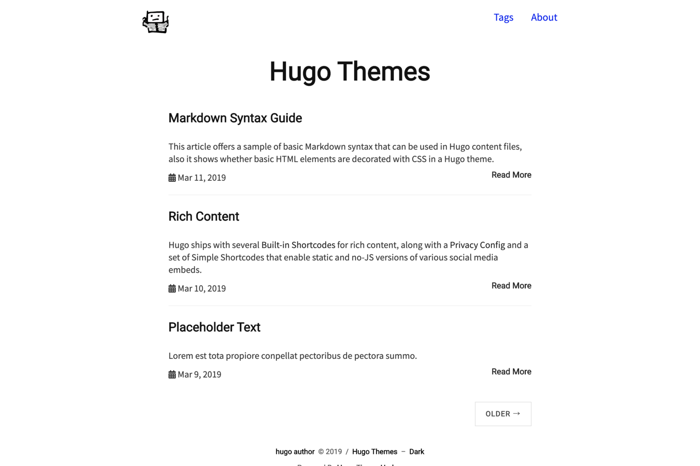

# harbor - Simple Hugo Theme

Simple and minimal personal blog theme for [Hugo](https://gohugo.io/).

## Screenshot




## Features

- Support tags
- Google Analytics integration
- Responsive
- Syntax Highlight (see [Hugo doc](https://gohugo.io/content-management/syntax-highlighting/))

## Installation & Update

```
$ # install
$ mkdir themes
$ cd themes
$ git submodule add https://github.com/matsuyoshi30/harbor.git harbor

$ # update
$ git submodule update --remote --merge
```

If you want to know more information, see [Hugo doc](https://gohugo.io/themes/installing/).

## `config.toml` example

```
baseurl = "https://example.com/"
title = "Hugo Themes"
paginate = 3
languageCode = "en"
DefaultContentLanguage = "en"
enableInlineShortcodes = true
footnoteReturnLinkContents = "^"

googleAnalytics = "UA-XXXXXXXX-XX" # Optional

[Author]
  name = "Hugo Author"

[[menu.main]]
  identifier = "about"
  name = "About"
  url = "/about/"
  weight = 3

[[menu.main]]
  identifier = "tags"
  name = "Tags"
  url = "tags"
  weight = 3

[params.logo]
  url = "icon.png"
  width = 50
  height = 50
  alt = "Logo"
```

## Frontmatter example

```
+++
title = "Article title here"
date = 2020-02-15T20:00:00+09:00
tags = ["tags here"]
draft = false
+++
```

## LICENSE

[MIT](./LICENSE).
